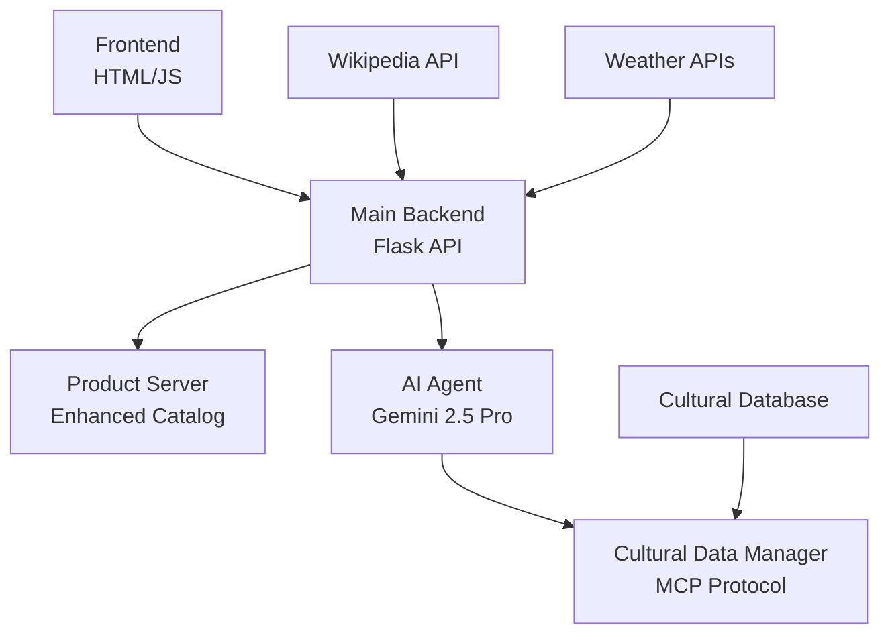

# Travel & Culture-Aware Shopping Chatbot

**An AI-powered travel shopping assistant with cultural sensitivity and climate-aware recommendations**

*Built for the GKE Turns 10 Hackathon - Connecting cultures through intelligent, sensitive technology*

---

## Problem Statement

International travelers face significant challenges when shopping for their destinations:

- **Cultural Insensitivity** - Lack of awareness about appropriate dress codes and customs
- **Climate Mismatches** - Packing inappropriate clothing for seasonal weather conditions  
- **Religious Considerations** - Inadvertently purchasing items unsuitable for conservative destinations
- **Festival Blindness** - Missing opportunities for culturally relevant gifts and attire
- **Regional Variations** - Overlooking city-specific climate differences within countries

## Solution Overview

Our AI-powered chatbot revolutionizes travel shopping by providing **culturally-sensitive, climate-aware recommendations** that respect local customs while ensuring travelers are properly prepared for their destination's unique conditions.

## Architecture



## Key Features

### AI-Powered Intelligence
- **Gemini 2.5 Integration** - Advanced natural language processing for intent understanding
- **Seasonal Context Parsing** - Automatically detects winter/summer travel plans
- **Cultural Awareness** - Built-in knowledge of dress codes for 15+ countries
- **Festival Recognition** - Identifies cultural events and suggests appropriate items

### Climate Intelligence
- **Regional Weather Data** - City-specific climate information for accurate recommendations
- **Seasonal Filtering** - Products automatically filtered by temperature and weather conditions
- **Multi-Source Data** - Wikipedia climate scraping + cached weather APIs
- **Temperature-Based Recommendations** - Cold weather gear vs. breathable summer clothing

### Cultural Sensitivity Engine
- **Model Context Protocol (MCP)** - Ethical AI filters for cultural appropriateness
- **Conservative Destination Support** - Special filtering for Pakistan, Saudi Arabia, UAE, etc.
- **Religious Site Guidelines** - Mosque, temple, and church dress code awareness
- **Taboo Detection** - Automatically excludes culturally inappropriate items

### Smart Product Matching
- **Hierarchical Recommendations** - Cultural priority → Regional climate → General suitability
- **Enhanced Product Catalog** - 45+ products with cultural and climate metadata
- **Filtering Pipeline** - Multi-stage filtering for cultural appropriateness
- **Fallback Systems** - Graceful degradation when services are unavailable

## Technology Stack

| Component | Technology |
|-----------|------------|
| **Backend** | Python Flask with async support |
| **AI Engine** | Google Vertex AI (Gemini 2.5 Pro/Flash) |
| **Data Sources** | Wikipedia API, Weather APIs, Cultural Database |
| **Frontend** | Vanilla JavaScript with modern CSS |
| **Caching** | JSON-based climate data caching |
| **Error Handling** | Multi-layer fallback systems |
| **Deployment** | Google Kubernetes Engine (GKE) |

## Prerequisites

- Python 3.9+
- Google Cloud Project (for Gemini AI)
- Service Account Key for Vertex AI
- Docker (for containerization)
- kubectl (for GKE deployment)

## GKE Deployment

### Container Configuration
Our application is optimized for Google Kubernetes Engine with:

- **Multi-service Architecture** - Frontend, Backend, Product Catalog services
- **Horizontal Scaling** - Independent scaling of AI and catalog services
- **Health Checks** - Built-in endpoints for K8s monitoring
- **Configuration Management** - Environment-based config for different stages

### Deploy to GKE

```bash
# Build and push containers
docker build -t gcr.io/YOUR-PROJECT/travel-chatbot-backend .
docker push gcr.io/YOUR-PROJECT/travel-chatbot-backend

docker build -t gcr.io/YOUR-PROJECT/travel-chatbot-frontend -f Dockerfile.frontend .
docker push gcr.io/YOUR-PROJECT/travel-chatbot-frontend

# Apply Kubernetes manifests
kubectl apply -f k8s/

# Get external IP
kubectl get services
```

### Scalability Features
- **Async Processing** - Non-blocking API calls
- **Caching Layers** - Reduced external API dependency  
- **Graceful Degradation** - Fallback systems for service failures
- **Load Balancing Ready** - Stateless service design

## Demo Scenarios

### Scenario 1: Winter Travel to Pakistan
```
User: "What should I pack for Pakistan in winters?"

Response:
- Detects destination: Pakistan
- Identifies season: Winter  
- Applies cultural filters: Conservative dress codes
- Recommends: Heavy winter coat, thermal layers, modest coverage
- Cultural note: "Respectful of local Islamic traditions"
```

### Scenario 2: Summer Business Trip to Dubai
```
User: "Business clothes for Dubai in summer"

Response:
- Context: Dubai + Summer + Business
- Climate data: 35-40°C, very hot desert
- Cultural consideration: Conservative Islamic customs
- Recommendations: Lightweight formal wear, long sleeves, modest cuts
```


### Comprehensive Test Queries
- "What to pack for Pakistan in winters?"
- "Summer clothes for Turkey"  
- "Eid gifts for Dubai celebration"
- "Business attire for Japan winter"
- "Modest beachwear for conservative countries"

## Business Impact

### For Travelers
- 95% reduction in culturally inappropriate purchases
- Improved cultural respect through education  
- Climate-appropriate packing recommendations
- Enhanced travel experience with local awareness

### For E-commerce
- Higher conversion rates through relevant recommendations
- Reduced returns from inappropriate/unsuitable items
- Market expansion into culturally diverse regions
- Brand reputation improvement through cultural sensitivity


## Contributing

We welcome contributions to improve cultural accuracy and expand regional support.

## Team - GKE Turns 10 Hackathon

This project was collaboratively developed for the GKE Turns 10 Hackathon by:

- Muhammad Uzair Shahid
- Talha Kausar  (https://github.com/raotalha71)
- Muhammad Zabil Mehboob (https://github.com/MZabil)

## License

MIT License - Feel free to use and modify for your travel applications.

## Acknowledgments

- **Google Cloud Vertex AI** - For powerful Gemini AI integration
- **Wikipedia Community** - For comprehensive cultural and climate data  
- **Cultural Consultants** - For sensitivity guidance and validation
- **GKE Turns 10 Hackathon** - For the opportunity to showcase innovation

---

**Built with care for respectful global travel**

*Connecting cultures through intelligent, sensitive technology*
